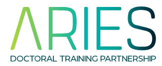
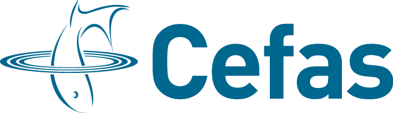

# Introduction to Python in Environmental Sciences
*ARIES & Cefas course*

## General information

* The 3-day course organised by [ARIES DTP](https://www.aries-dtp.ac.uk/) and [Cefas](http://www.cefas.co.uk/) giving a hands-on introduction to [Python](http://www.python.org/) programming language.
* You will learn Python programming, starting from the basics, and evolving into data analysis aand visualisation using data formats commonly used in environmental sciences.
* Suitable for both python novices and intermediate users.
* In person course at the UEA (Blackdale school building). Lunch and refreshments will be provided.
* We will offer a limited number of places online for ARIES studends that are not registered with the UEA and CEFAS staff based in Weymouth.  

### When and where

| Day | Time (BST) | Location | Topics covered |
|-----|----------|-------|----------|
| 1st of July 2023 | 8:30 - 17:00 | UEA BDS 0.21 | Python basics |
| 2nd of July 2023 | 9:00 - 17:00 | UEA BDS 0.21 | Functions, simple programs and arrays |
| 3rd of July 2023 | 9:00 - 17:00 | UEA BDS 0.21 | Plotting and data analysis |

Full timetable available [here](programme.md).

### Topics covered by the course
* Python basics and programming environment
* Core scientific libraries: numpy, scipy, pandas
* Simple visualisation in matplotlib
* Plotting data on maps
* Working with environmental sciences data formats

### Ahead of the course 

* [Install](installation.md) course environment and materials in the week before.
* Bring your own laptop.

## Registration and enquiries

The course is free for 

* Aries DTP students
* Cefas staff and CASE students

The course is open to all UEA students and staff but there is a fee of 50 GBP. See contact below for enquiries.

Register at [Eventbrite](https://www.eventbrite.co.uk/).

If you have queries please contact:

* [Jenny (Cefas)](mailto:jennifer.graham@cefas.gov.uk)
* [Eliza (UEA, Aries)](mailto:e.karlowska@uea.ac.uk)

## Unable to attend?

Contact us by email to receive access to the recorded sessions. 

## Support after the course? 

### Cefas
The PyFAS group meets regularly, to present work, discuss python problems and provide general support. 

Contact Claire Beraud to join the group and receive future invites.

The Turn up & Code code group meets regularly to support personal development in programming in any language.

Contact Lianne Harrison if you ar enot receiving calendar invites.

### UEA
The UEA Python group meets occasionally. Check the archives of previous sessions here: [https://ueapy.github.io](https://ueapy.github.io/). Or join our [Slack workspace](https://uea-python.slack.com/) to ask questions and take part in weekly coding drop ins.

